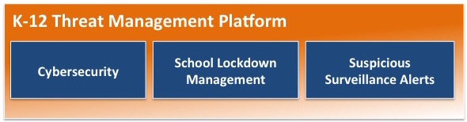
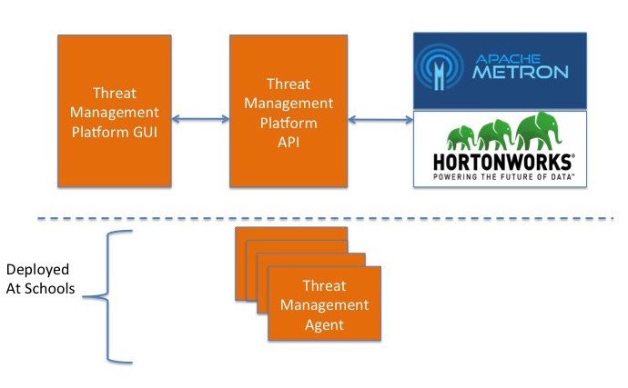

# Threat Management Platform (formally Threat Detection Service)

The purpose of the Threat Management Platform (TMP) is to provide a platform to protect K-12 schools from threats.  The threats can be Cyberattacks, Active Shooter, Child Predretors and etc.  Hence, the core modules of TMP is CyberSecurity, School Lockdown Management and Suspicious Surveillance Alerts.  The following diagram depicts the core modules:  

This project was started in Detroit with a focus on delivering a solution to Detroit Charter Schools, but the project can leveraged for any school.    

The first release of this software is focused on cybersecurity.  We find that a portion of the Internet bandwidth for Detroit Charter Schools are being utilzied by hackers trying to take control of machines on the network to commit cyberattacks against other organizations.  Also, there are computer viruses that install as ransomware where they pose as legitimate anti-virus software, but really they are just trying to obtain credit card numbers by having the user purchase fake virus software.  Lastly, we want to protect the identity of the students and prevent unauthorizied access to their private information, which could be used to hijack the identity of the student.  The theft of an identity causes major issues for an adult, but can cause similar issues or worst issues for a student down the road.

Our Threat Management Platform is using [Apache Metron](http://metron.incubator.apache.org/) as the core engine.   In order to detect Child Predretors we plan to use facial recognition software developed by [Kairos](https://www.kairos.com/)

The architecture for TMP is shown below:

The TMP API Server can be used to provide an API on top of Metron.  Metron has alot of raw functionality and it's evolving each day.  Our API provides a high level interface into Metron and adds concepts such as a User, Asset and Agents.  We have developed the API to be easy to install and configure.  Also, it comes with some sample data.  The instructions to configure the API can be found [here](./api)

